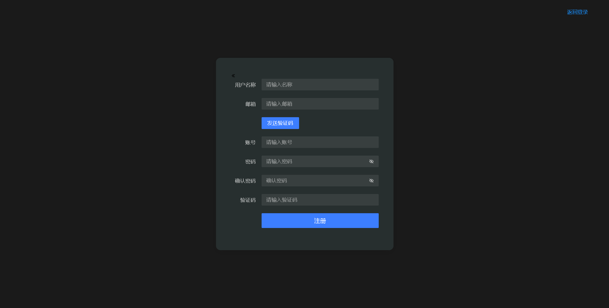
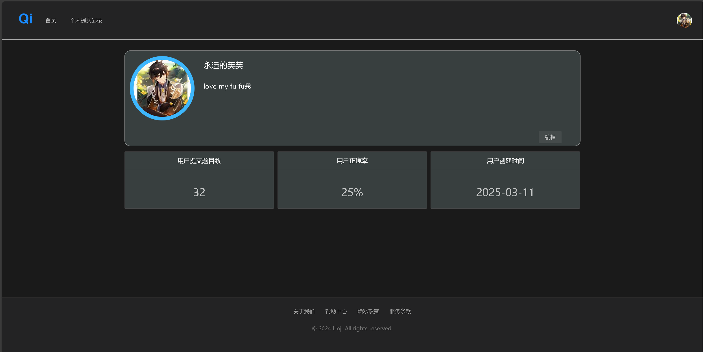
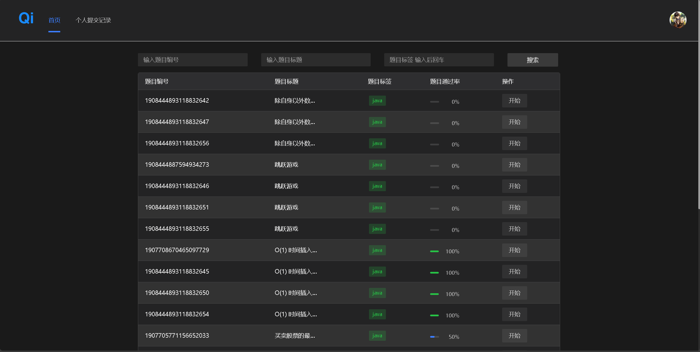
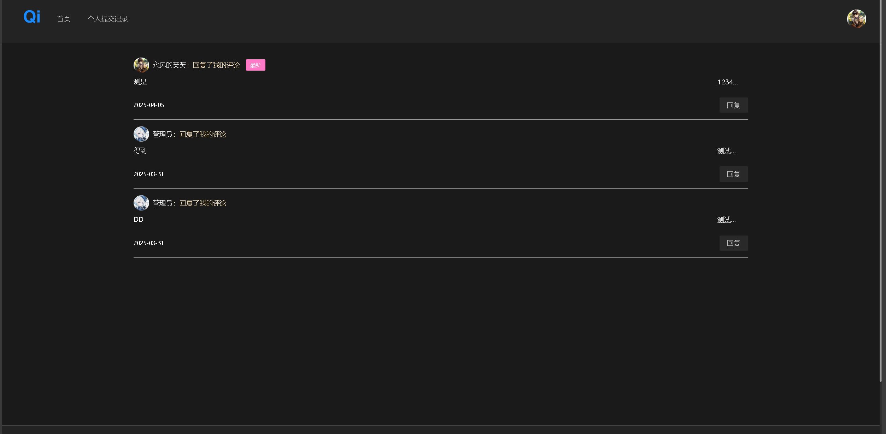
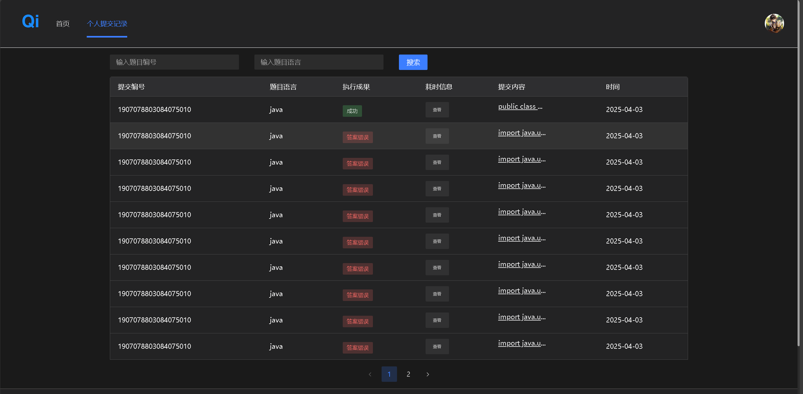

# OJ-LION
## 前言


`OJ-LION`:

```
全栈OJ系统，自动判题，ai生成题，检错，评论注册登录，等功能，有帮助到您，可以点个start
```

## 技术选型


  <br/>
- 前端
<br/>

```
    初始化:vue3 webpack vue-cli Typescript
    插件：
    1.vuex：用户登录信息存储
    2.vue-router:路由权限控制
    3.md插件
    4.代码编辑器插件
    5.Arco Design Vue组件库
    6.open Api 自动化接口文档
```

  <br/>
- 后端
  <br/>

```
    初始化:Sprinboot MYSQL Redis Mybtisplus 
    核心功能：
    1. QQ邮箱发送
    2. cos存储
    3. 千问模型
    4. Swagger+injfo4
```

## 项目介绍

`OJ-LION`
```txt
    这是个简便的OJ系，当然你可以进行二开！,毕设等（目前功能介绍）
    
    毕设我可以提供下思路：
    比如
    - 表格换成卡片
    - 登录界面UI完善（都是ai写了，所以简便）
    - 注册界面UI完善（都是ai写了，所以简便）
    列如：在线竞赛（功能）其他语言的实现等
    功能介绍：
    (用户)
    1.QQ邮箱注册
    2.账号密码登录
    3.评论点赞留言
    4.查看留言
    5.提交题目
    6.查看提交题目状态
    7.修改个人信息，个人提交数等
    
     (管理员)
    8.修改题目
    9.添加题目
    10.ai添加题目（有点费token，千问免费，就是有点慢）
    11.查看所有用户的提交信息
```

##目录介绍
- .vscode
- li-backend-master：后端代码
- li-code-sandbox-master：代码在线沙箱
- lioj-fonont：前端代码
- ui：ui图片

### 搭建步骤

> Windows(本地搭建)
- git clone https://github.com/Musicys
- 前端（lioj-fonont）：npm i 或者 yarn i
- 运行npm run serve 打包 npm run bulid `部署推荐Nginx`
- 后端（li-code-sandbox-master）：配置 .env配置 数据库，启动 打包即可
- 后端沙箱(本地li-code-sandbox-master)：可以使用第三方远程沙箱，或者docker配置沙箱


### 项目演示
<hr>

`管理员账号`：liwang

<br/>

`密码`：12345678

<br/>

项目演示地址：(http://101.42.172.99/)  

<br/>


``` 请勿dos攻击，服务器崩溃不在上线```


# 系统界面展示

### 注册界面
  
- **功能**：新用户通过邮箱/手机号注册账号

### 登录界面
  
- **功能**：账号密码登录
### 未登录门户页
  


### 个人信息管理

- **技术**：基于Ant Design Vue表单组件实现
---
## 核心功能模块
### 普通用户主页

- **交互**：可拖拽卡片实现界面个性化定制
- 
### 题目交流区
  
- **功能**：Markdown富文本讨论区

### 提交记录
  
- **展示**：代码执行状态/耗时/内存消耗对比
---
## 管理后台模块
### 数据仪表盘
.png)  
- **监控**：实时显示系统健康度/访问量趋势
### Ai题目生成
.png)  
- **功能**：批量操作/权限分配/登录日志查询
### 题目管理界面
.png)
### 内容审核中心
.png)
## 题目交互系统
### 题目列表页
.png)
### 题目详情页
.png)
### 在线代码编辑器
.png)


> 注：所有图片路径基于`/ul/`目录，实际使用请确保路径配置正确。界面采用Ant Design Vue 4.x设计规范，主色系为科技蓝（#1890ff）+ 活力橙（#ff7a45）搭配。
### 界面设计规范
1. **视觉层级**：使用Ant Design Vue组件库，符合WCAG 2.1无障碍标准


#### 后端技术

| 技术                      | 说明                | 官网                                                         |
| ------------------------- | ------------------- | ------------------------------------------------------------ |
| Spring Boot 2.7.2         | Web应用开发框架     | [官网](https://spring.io/projects/spring-boot)               |
| MyBatis-Plus 3.5.2        | 增强型ORM框架       | [官网](https://baomidou.com/)                                |
| Spring Data Redis         | Redis集成           | [官网](https://spring.io/projects/spring-data-redis)         |
| Spring Data Elasticsearch | 搜索引擎集成        | [官网](https://spring.io/projects/spring-data-elasticsearch) |
| Knife4j 3.0.3             | Swagger增强文档工具 | [官网](https://doc.xiaominfo.com/)                           |
| Hutool 5.8.8              | Java工具类库        | [官网](https://hutool.cn/)                                   |
| Lombok                    | 代码简化库          | [官网](https://projectlombok.org/)                           |
| Spring Mail               | 邮件服务支持        | [官网](https://spring.io/projects/spring-mail)               |
| 腾讯云COS SDK 5.6.89      | 对象存储服务        | [文档](https://cloud.tencent.com/document/product/436)       |
| EasyExcel 3.1.1           | Excel读写工具       | [官网](https://easyexcel.opensource.alibaba.com/)            |
| OkHttp 4.10.0             | HTTP客户端          | [官网](https://square.github.io/okhttp/)                     |
| Gson 2.9.1                | JSON序列化库        | [GitHub](https://github.com/google/gson)                     |
| WxJava 4.4.0              | 微信公众号开发SDK   | [GitHub](https://github.com/Wechat-Group/WxJava)             |
| Spring AOP                | 面向切面编程        | [官网](https://spring.io/projects/spring-aop)                |
#### 前端技术

| 技术                 | 说明               | 官网                                               |
| -------------------- | ------------------ | -------------------------------------------------- |
| Vue 3                | 前端框架           | [官网](https://vuejs.org/)                         |
| Vue Router 4         | 路由管理           | [官网](https://router.vuejs.org/)                  |
| Vuex 4               | 全局状态管理       | [官网](https://vuex.vuejs.org/)                    |
| Ant Design Vue 4.2.6 | UI组件库           | [文档](https://www.antdv.com/docs/vue/introduce)   |
| Axios 1.8.1          | HTTP请求库         | [官网](https://axios-http.com/)                    |
| ECharts 5.6.0        | 数据可视化图表库   | [官网](https://echarts.apache.org/)                |
| Monaco Editor 0.41.0 | 代码编辑器         | [官网](https://microsoft.github.io/monaco-editor/) |
| ByTMD 1.22.0         | Markdown编辑器插件 | [GitHub](https://github.com/bytedance/bytemd)      |
| Moment 2.29.4        | 时间处理库         | [官网](https://momentjs.com/)                      |


### 部署环境

| 工具  | 版本号 | 下载                                                                                 |
| ----- | ------ | ------------------------------------------------------------------------------------ |
| JDK   | 1.8    | https://www.oracle.com/technetwork/java/javase/downloads/jdk8-downloads-2133151.html |
| MySQL | 5.7    | https://www.mysql.com/                                                               |
| Redis | 7.0    | https://redis.io/download                                                            |
| Nginx | 1.22   | http://nginx.org/en/download.html                                                    |

