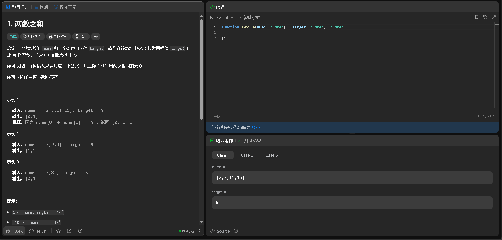

# 前端分支 main

# open Api 
`通过和后端docer对接，实现前后端分离`
`通过swagger-ui实现接口文档的编写`

- 安装命令 `npm install openapi-typescript-codegen --save-dev`

- 生成api命令 `npx openapi --input http://localhost:8101/api/v2/api-docs --output ./generated --client axios`

- 组件库： Arco Design Vue; Ai自动生成
- 路由： vue-router;: 动态路由权限认证
- 状态管理： vuex; 分布式管理
- 请求： axios; 拦截器 openai自动生成文档

  

##  优化提交题目界面-.-

## 优化答题界面-.-

## 优化主页-.-

## 登录界面 -.-

## 注册界面-_-

"sortField": "id",      //升序
"sortOrder": "descend",//降序
## 用户修改信息 -.-

## 优化提交记录页面-_-

## Ai生成题目

 deepseek`https://platform.deepseek.com/api_keys`
 apikey:`sk-8415c4c714814683aa968a45cd0f553b`

## 用户信息页面

## 提交题目优化

  

## 优化提交界面

